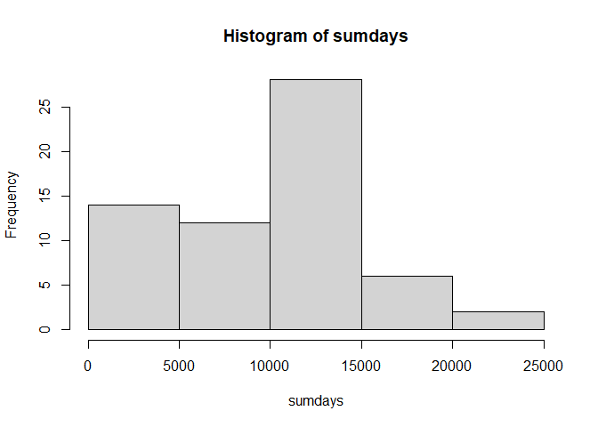
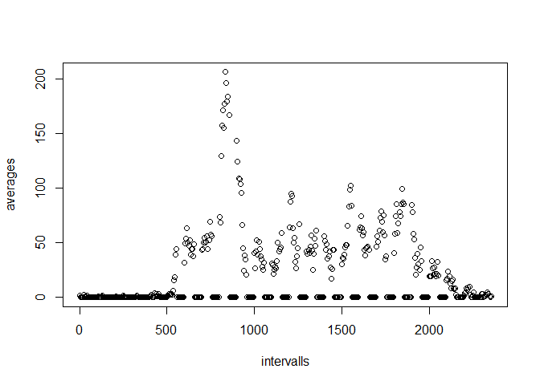
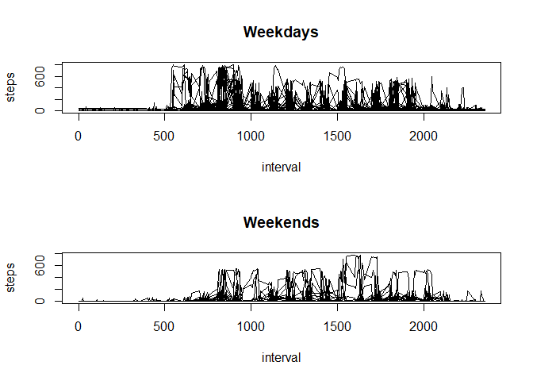

## Loading and preprocessing the data


```r
data<- read.csv("activity.csv")
```


## What is mean total number of steps taken per day?
1. Calculate the total steps per day:

```r
meandays<- data.frame(matrix(ncol=1,c(1:31,1:31)))

 g<-c("Date")
colnames(meandays)<-g
  f<-c()
  h<-c()
  sumdays<-c()
  data<-na.omit(data)
for(x in 1:31){
    
    if(x<10){
       date<-paste("2012","-10-0",x,sep="")
        
        }
        else if(x>9 & x <32){
       date<-paste("2012","-10-",x,sep="")
       
        
        }
    else{
        
    }

    data2<-data[data$date==date,]
    for(y in 1:nrow(data2)){
        
        f<-c(f,data2[y,1])
        
    }
     f<-sum(na.omit(f))
     sumdays<-c(sumdays,f)
     f<-c()
}
  
for(x in 1:31){
    
    if(x<10){
        date<-paste("2012","-11-0",x,sep="")
    } else{
        date<-paste("2012","-11-",x,sep="")
    }
    
     data2<-data[data$date==date,]
    for(y in 1:nrow(data2)){
        h<-c(h,data2[y,1])
        
    }
    h<-sum(na.omit(h))
    sumdays<-c(sumdays,h)
    h<-c()
    
}
```
Total steps per day:


```r
output<-cbind(meandays,sumdays)
print(output)
```

```
##    Date sumdays
## 1     1       0
## 2     2     126
## 3     3   11352
## 4     4   12116
## 5     5   13294
## 6     6   15420
## 7     7   11015
## 8     8       0
## 9     9   12811
## 10   10    9900
## 11   11   10304
## 12   12   17382
## 13   13   12426
## 14   14   15098
## 15   15   10139
## 16   16   15084
## 17   17   13452
## 18   18   10056
## 19   19   11829
## 20   20   10395
## 21   21    8821
## 22   22   13460
## 23   23    8918
## 24   24    8355
## 25   25    2492
## 26   26    6778
## 27   27   10119
## 28   28   11458
## 29   29    5018
## 30   30    9819
## 31   31   15414
## 32    1       0
## 33    2   10600
## 34    3   10571
## 35    4       0
## 36    5   10439
## 37    6    8334
## 38    7   12883
## 39    8    3219
## 40    9       0
## 41   10       0
## 42   11   12608
## 43   12   10765
## 44   13    7336
## 45   14       0
## 46   15      41
## 47   16    5441
## 48   17   14339
## 49   18   15110
## 50   19    8841
## 51   20    4472
## 52   21   12787
## 53   22   20427
## 54   23   21194
## 55   24   14478
## 56   25   11834
## 57   26   11162
## 58   27   13646
## 59   28   10183
## 60   29    7047
## 61   30       0
## 62   31       0
```
Print a histogram with the data:

```r
hist(sumdays)
```

<!-- -->
  
  Mean and Median of Total steps each day:

```r
print(paste("Mean is:",as.character(mean(sumdays)),".",sep=" "))
```

```
## [1] "Mean is: 9203.35483870968 ."
```

```r
print(paste("Median is:",as.character(median(sumdays)),"."))
```

```
## [1] "Median is: 10349.5 ."
```

## What is the average daily activity pattern?

```r
averages<-c()
intervalls<-seq(from=0,to=2355,by=5)
data<-na.omit(data)
data3<-data[c(1,3)]
for( x in intervalls){
    
    data3<-data3[data3$interval==x,]
    data3<-data3[1]
    data3<-lapply(data3,mean)
    
    if(is.nan(as.numeric(data3))){
        averages<-c(averages,0)
         data3<-data[c(1,3)]
    }
    else{
    averages<-c(averages,data3)
    data3<-data[c(1,3)]
    }
}
plot(x=intervalls,y=averages)
```

<!-- -->

```r
data5<-data.frame(cbind(intervalls,averages))
data6<-unlist(data5[2])
Maximum<-max(data6)
MaximumOutput<-data5[data5$averages==max(data6),]
MaximumOutput<-unlist(MaximumOutput[1])

print(paste("This intervall contains the maximum number of steps:",as.character(MaximumOutput)))
```

```
## [1] "This intervall contains the maximum number of steps: 835"
```


## Imputing missing values
1. Total number of missing values:

```r
data<- read.csv("activity.csv")
data10<-na.omit(data)

print(paste("Total number of missing values is:",as.character(nrow(data)-nrow(data10))))
```

```
## [1] "Total number of missing values is: 2304"
```
2. & 3. Filling missing values with "0":

```1
data<- read.csv("activity.csv")
data[is.na(data)] <- 0

```
4. Histogram of new data set:

```r
meandays<- data.frame(matrix(ncol=1,c(1:31,1:31)))

 g<-c("Date")
colnames(meandays)<-g
  f<-c()
  h<-c()
  sumdays<-c()
for(x in 1:31){
    
    if(x<10){
       date<-paste("2012","-10-0",x,sep="")
        
        }
        else if(x>9 & x <32){
       date<-paste("2012","-10-",x,sep="")
       
        
        }
    else{
        
    }

    data2<-data[data$date==date,]
    for(y in 1:nrow(data2)){
        
        f<-c(f,data2[y,1])
        
    }
     f<-sum(na.omit(f))
     sumdays<-c(sumdays,f)
     f<-c()
}
  
for(x in 1:31){
    
    if(x<10){
        date<-paste("2012","-11-0",x,sep="")
    } else{
        date<-paste("2012","-11-",x,sep="")
    }
    
     data2<-data[data$date==date,]
    for(y in 1:nrow(data2)){
        h<-c(h,data2[y,1])
        
    }
    h<-sum(na.omit(h))
    sumdays<-c(sumdays,h)
    h<-c()
    
}
##Total number of steps each day:
output<-cbind(meandays,sumdays)
print(output)
```

```
##    Date sumdays
## 1     1       0
## 2     2     126
## 3     3   11352
## 4     4   12116
## 5     5   13294
## 6     6   15420
## 7     7   11015
## 8     8       0
## 9     9   12811
## 10   10    9900
## 11   11   10304
## 12   12   17382
## 13   13   12426
## 14   14   15098
## 15   15   10139
## 16   16   15084
## 17   17   13452
## 18   18   10056
## 19   19   11829
## 20   20   10395
## 21   21    8821
## 22   22   13460
## 23   23    8918
## 24   24    8355
## 25   25    2492
## 26   26    6778
## 27   27   10119
## 28   28   11458
## 29   29    5018
## 30   30    9819
## 31   31   15414
## 32    1       0
## 33    2   10600
## 34    3   10571
## 35    4       0
## 36    5   10439
## 37    6    8334
## 38    7   12883
## 39    8    3219
## 40    9       0
## 41   10       0
## 42   11   12608
## 43   12   10765
## 44   13    7336
## 45   14       0
## 46   15      41
## 47   16    5441
## 48   17   14339
## 49   18   15110
## 50   19    8841
## 51   20    4472
## 52   21   12787
## 53   22   20427
## 54   23   21194
## 55   24   14478
## 56   25   11834
## 57   26   11162
## 58   27   13646
## 59   28   10183
## 60   29    7047
## 61   30       0
## 62   31       0
```

```r
##Histogram
hist(sumdays)
```

<!-- -->

```r
##Mean and median
print(paste("Mean is:",as.character(mean(sumdays)),".",sep=" "))
```

```
## [1] "Mean is: 9203.35483870968 ."
```

```r
print(paste("Median is:",as.character(median(sumdays)),"."))
```

```
## [1] "Median is: 10349.5 ."
```

If not chosen carefully a replacement value can lead to bias. In my case, replacing the NA-values with 0 does not lead to bias, because it is like removing the NA values from the data. 


## Are there differences in activity patterns between weekdays and weekends?


```r
##1. Factor variable
dates<-data[2]
k<-factor(c("weekday","weekend"))

##2. Checking if dates are weekdays or weekends
data<- read.csv("activity.csv")


for(x in 1:31){
    
    if(x<10){
       date<-paste("2012","-10-0",x,sep="")
        
        }
        else if(x>9 & x <32){
       date<-paste("2012","-10-",x,sep="")
       
        }
        else{
        
    }
    data [data==date] <- weekdays(as.Date(date))


}
  
for(x in 1:30){
    
    if(x<10){
        date<-paste("2012","-11-0",x,sep="")
    } else{
        date<-paste("2012","-11-",x,sep="")
    }
     
    data [data==date] <- weekdays(as.Date(date))
    
}
B<-(c("Montag","Dienstag","Mittwoch","Donnerstag","Freitag"))
b<-(c("Samstag","Sonntag"))
for(y in 1:nrow(data)){
    if(data[y,2] %in% B){
        data[y,2] <- "weekday"
    }
    else{
        data[y,2] <- "weekend"
    }
}
data[is.na(data)] <-0

#split data set into weekdays and weekends

##weekdays
data11<-data
data11 [data11 =="weekend"] <-NA
data11<-na.omit(data11)
data11<-data11[c(3,1)]


##weekends
data12<-data
data12 [data12 =="weekday"] <-NA
data12<-na.omit(data12)
data12<-data12[c(3,1)]


 
  ## Plotting out the data
  
par(mfrow=c(2,1))
plot(data11,main="Weekdays",type="l")
plot(data12,main="Weekends",type="l")
```

<!-- -->


